<p align="center">
  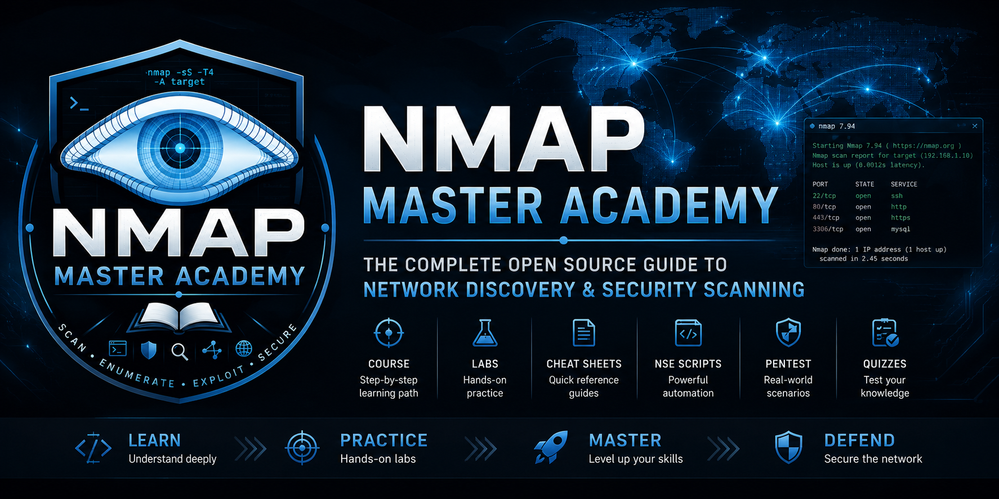
</p>

<h1 align="center">🛡️ Nmap Master Academy</h1>

<p align="center">
A comprehensive open-source Nmap learning repository with structured documentation,
hands-on labs, quizzes, real-world scenarios, and AI-powered learning.
</p>

<p align="center">


</p>

## 🤖 AI Learning Assistant

<p align="center">
  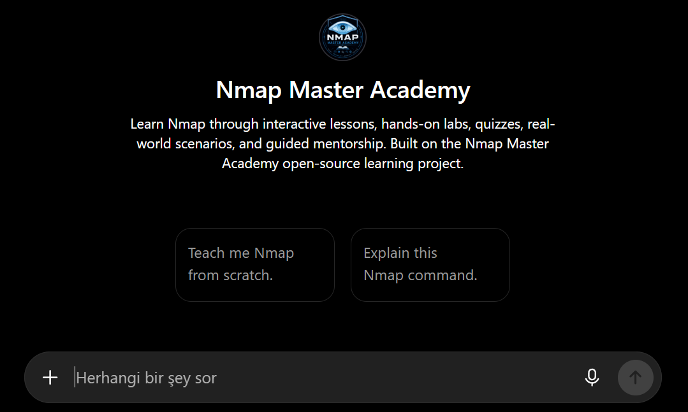
</p>

<p align="center">

### 🚀 Try the Nmap Master Academy GPT

<a href="https://chatgpt.com/g/g-6a5fb8de442081919953cd93ac71db9a-nmap-master-academy">

</a>

</p>

## 📖 About

Nmap Master Academy is an open-source educational project created to help learners master Nmap through structured documentation, practical labs, quizzes, penetration testing workflows, and AI-assisted learning.

Instead of focusing only on commands, this repository follows a complete learning path from beginner concepts to advanced NSE scripting and real-world usage.

## ✨ Features

- 📘 **Structured Documentation** – Learn Nmap through a step-by-step curriculum from beginner to advanced topics.
- 📋 **Cheat Sheet** – Quickly access the most commonly used Nmap commands and options.
- 🧩 **Nmap Scripting Engine (NSE)** – Comprehensive guide covering NSE architecture, categories, Lua basics, and custom script development.
- 🧪 **Hands-on Labs** – Practical exercises designed to reinforce concepts with real scanning scenarios.
- ❓ **Interactive Quizzes** – Test your knowledge with chapter quizzes, answer keys, and a final exam.
- 🛡️ **Pentesting Workflows** – Learn how Nmap is used throughout real-world penetration testing engagements.
- 📚 **Reference Library** – TCP/UDP, TCP flags, common ports, network services, ASCII diagrams, and more.
- 🤖 **AI Learning Assistant** – Includes a custom GPT powered by the repository documentation for interactive learning and command explanations.
- 📊 **Visual Learning** – Diagrams, screenshots, workflow illustrations, and command examples throughout the documentation.

## 📸 Documentation Preview

| Cheat Sheet | Course |
|-------------|--------|
| 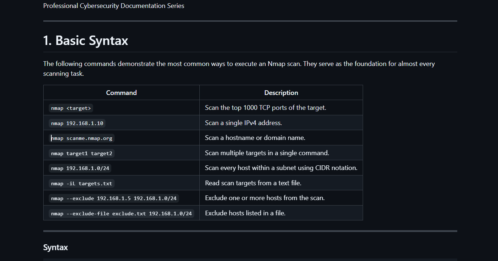 | 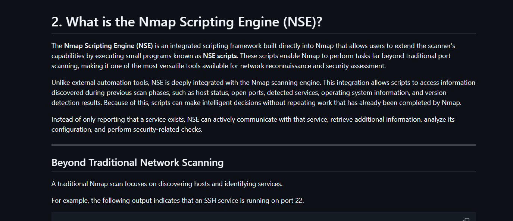 |

| Labs | Quiz |
|------|------|
| 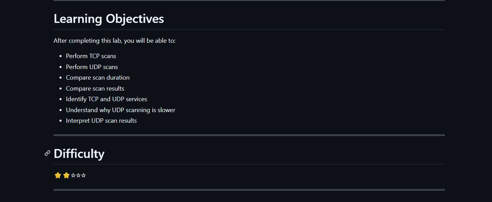 | 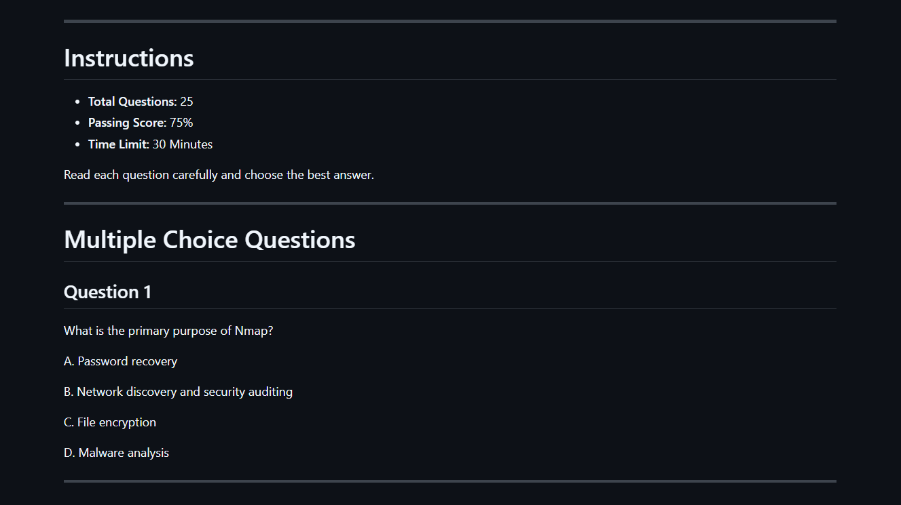 |

| Answer Key | AI Assistant |
|------------|--------------|
| 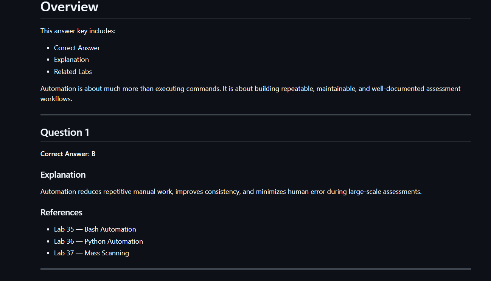 |  |

## 📊 Visual Learning

The repository contains custom diagrams that explain core networking concepts and Nmap workflows.

| TCP Three-Way Handshake | Network Port States |
|:-----------------------:|:-------------------:|
| 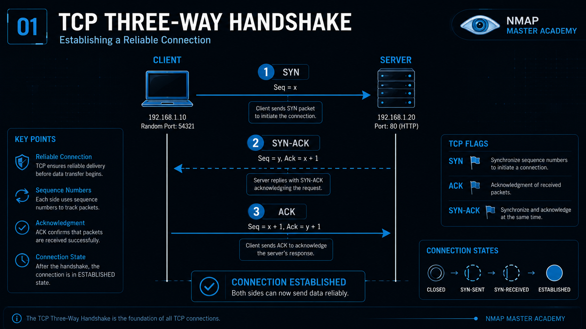 | 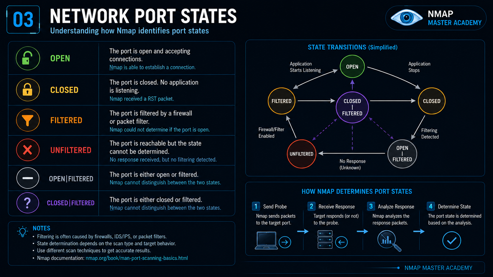 |

| Host Discovery Workflow | NSE Architecture |
|:-----------------------:|:----------------:|
| 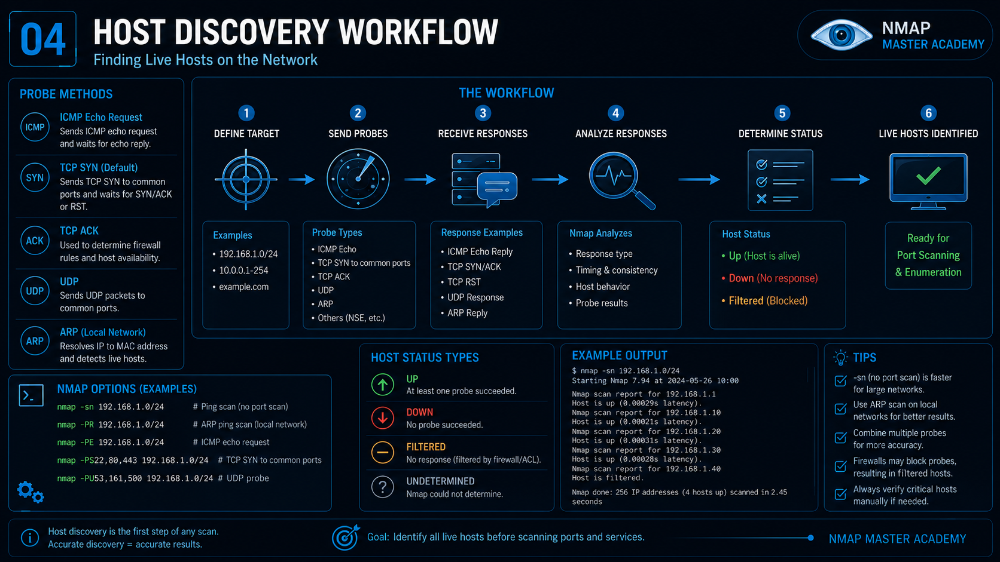 | 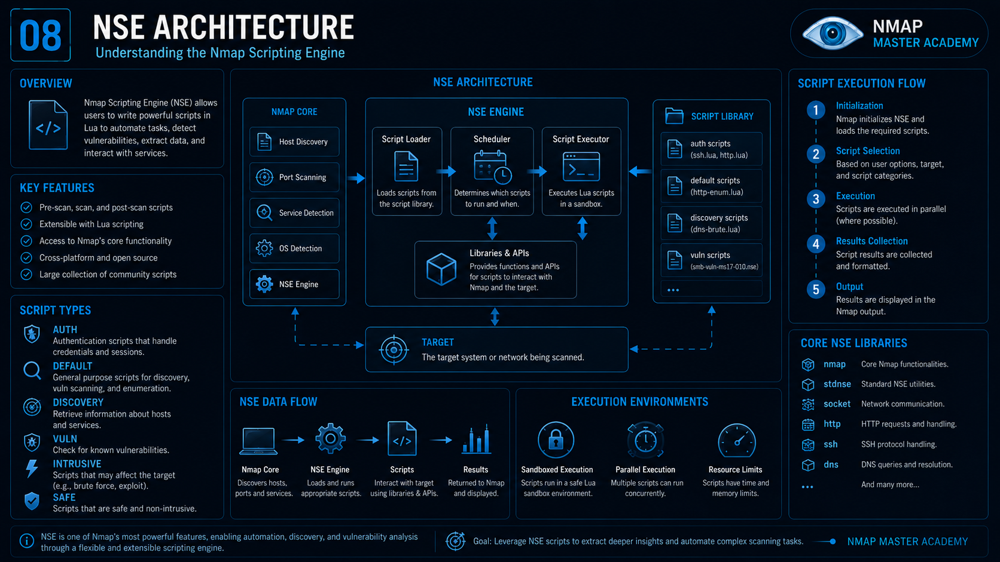 |

> 📁 Explore all **10+ diagrams** in the [`Assets/Diagrams`](./Assets/Diagrams) directory.

## 📂 Repository Structure

```text
Nmap_Master_Academy
│
├── 01_Cheat_Sheet      # Quick command reference
├── 02_Course           # Complete Nmap learning course
├── 03_NSE              # Nmap Scripting Engine & Lua
├── 04_Reference        # Ports, protocols and networking references
├── 05_Labs             # Hands-on practical exercises
├── 06_Quizzes          # Quizzes, answer keys and final exam
├── 07_Pentest          # Real-world pentesting workflows
│
├── Assets
│   ├── Banner
│   ├── Diagrams
│   ├── Logos
│   └── Screenshots
│
├── CONTRIBUTING.md
├── CODE_OF_CONDUCT.md
├── SECURITY.md
├── LICENSE
└── README.md
```

## 🗺️ Learning Roadmap

This repository is designed as a structured learning journey.

```text
Cheat Sheet
     │
     ▼
Course
     │
     ▼
Reference
     │
     ▼
Hands-on Labs
     │
     ▼
Quizzes
     │
     ▼
Pentest Workflows
     │
     ▼
AI Learning Assistant
```

## 📚 What You'll Learn

- Network Fundamentals
- Host Discovery
- TCP & UDP Scanning
- Port Scanning Techniques
- Service & Version Detection
- Operating System Detection
- Firewall & IDS Evasion
- Timing & Performance Optimization
- Output Formats & Reporting
- Nmap Scripting Engine (NSE)
- Lua Programming for NSE
- Custom NSE Script Development
- Practical Penetration Testing
- Automation with Bash & Python
- CTF & Hack The Box Enumeration

## 📈 Repository Highlights

| Category | Content |
|----------|---------:|
| 📘 Course Lessons | 20+ |
| 🧩 NSE Lessons | 58+ |
| 🧪 Hands-on Labs | 37+ |
| ❓ Quiz Sections | 6 |
| 🎓 Final Exam | ✔ |
| 📖 Reference Guides | 7+ |
| 📊 Diagrams | 10+ |
| 🤖 AI Learning Assistant | ✔ |

## 🌍 Open Source

Nmap Master Academy is an open-source educational project created to make high-quality cybersecurity education freely accessible to everyone.

Whether you're a student, IT professional, system administrator, or penetration tester, you're welcome to explore, learn, improve, and contribute to the project.

If you find this repository useful, consider giving it a ⭐ and sharing it with others.

## 🤝 Contributing

Contributions are always welcome!

You can help by:

- 📝 Improving documentation
- 🧪 Creating new hands-on labs
- ❓ Writing quizzes and exercises
- 🧩 Expanding NSE examples
- 🐛 Reporting bugs
- 💡 Suggesting new ideas
- 🌍 Translating documentation

Please read the **CONTRIBUTING.md** guide before opening a Pull Request.

## 🛡️ Community

We are committed to maintaining a welcoming, respectful, and collaborative environment.

Please read our:

- 📜 Code of Conduct
- 🔒 Security Policy
- 🤝 Contribution Guidelines

before participating in the project.

## 🚀 Roadmap

### Version 1.x

- [x] Structured documentation
- [x] Cheat Sheet
- [x] Complete Course
- [x] NSE Documentation
- [x] Reference Materials
- [x] Hands-on Labs
- [x] Interactive Quizzes
- [x] Pentesting Workflows
- [x] AI Learning Assistant

### Future Plans

- [ ] Interactive MkDocs Website
- [ ] Video Learning Series
- [ ] Additional Hands-on Labs
- [ ] Advanced NSE Projects
- [ ] Community Challenges
- [ ] Interactive Practice Platform
- [ ] More Diagrams & Visualizations
- [ ] Multi-language Documentation

## 📄 License

This project is licensed under the **MIT License**.

You are free to use, modify, distribute, and contribute to this project in accordance with the license terms.

See the **LICENSE** file for more information.

## 👨‍💻 Author

### Mertcan Kayırıcı

Cybersecurity • Networking • Open Source • Continuous Learning

🐙 GitHub: [MertcanKayirici](https://github.com/MertcanKayirici)

⭐ If this repository helped you, consider leaving a star!

---

<p align="center">

Part of the **Master Academy** open-source cybersecurity education series.

Made with ❤️ for the cybersecurity community.

</p>
